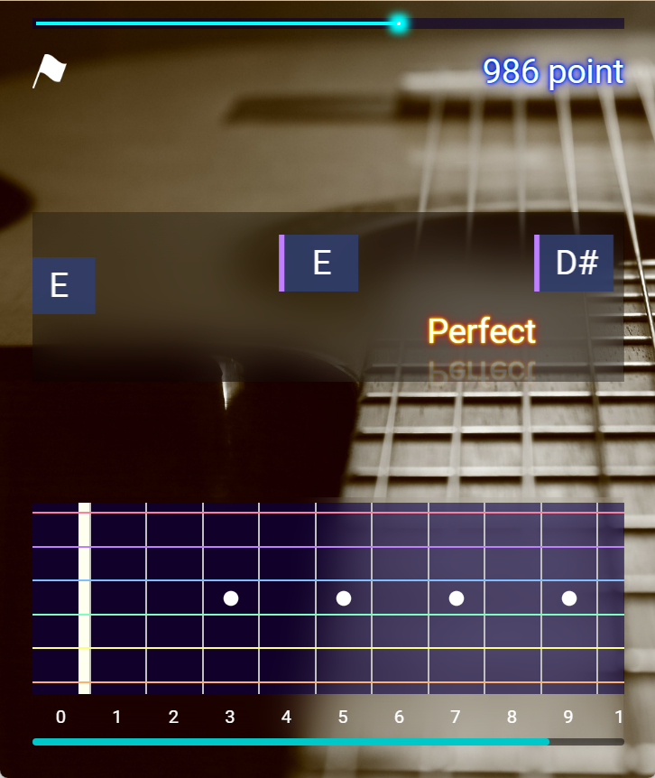

# 🎸 Guitar Fretboard Master

ギター指板上の音を覚えたり、楽譜読解トレーニングができるアプリです。

🌐 **Live Demo:**  
👉 https://fromqtop.github.io/GuitarFletboardMaster/

📰 **How to Play:**  
👉 https://web-breeze.net/guitar-fretboard-master-how-to-play/

## 補足
このアプリは2020年7月にAndroidアプリとしてGoogle Playに公開していたものをWeb版にしたものです。  
（現在は開発およびAndroidアプリ版の公開は停止しており、更新の予定はありません）
